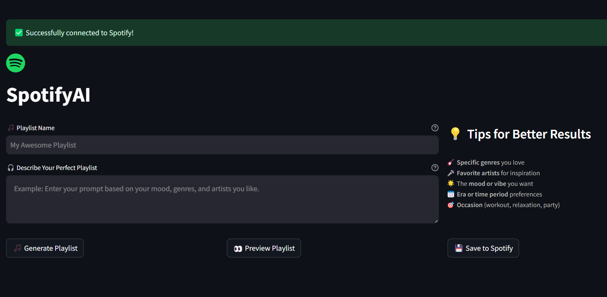

# Spotify Playlist Generator

An AI-powered tool that generates curated Spotify playlists based on your music preferences and mood! This app leverages real-time song details via Google Search and the Gemini API to produce a playlist of 20-25 hand-picked songs. Seamlessly integrated with Spotify, it allows you to create and save your custom playlists directly into your Spotify account.

## Features

- **AI-Curated Playlists:** Generate a curated list of songs based on your descriptive prompt.
- **Real-Time Song Data:** Fetch current song details using Google Search integrated within the agent.
- **Spotify Integration:** Authenticate with Spotify and save your generated playlists directly to your account.
- **User-Friendly UI:** Enjoy a modern, Spotify-inspired interface built with Streamlit.
- **Robust Error Handling:** Includes retry logic and fuzzy matching to ensure accurate song retrieval.

This is how the homepage of the interface looks like.
